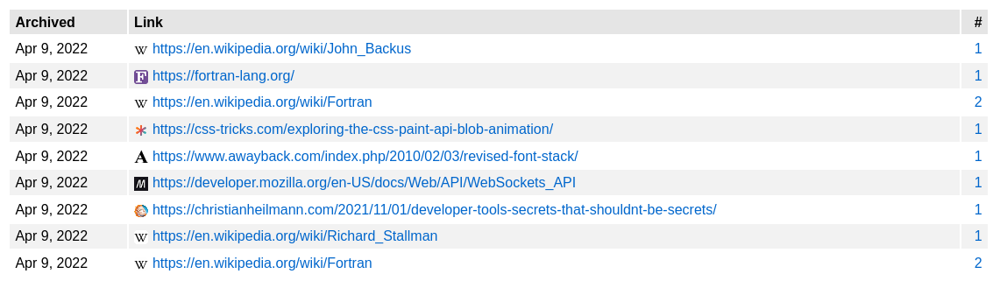
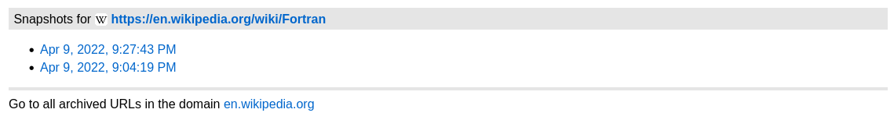
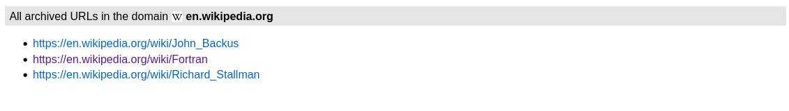

# sharc

sharc is a minimalistic bookmarking tool that archives the pages locally at your device and organizes them in a simple web interface. The download of the files is only based on wget - it has no other dependencies!

## Setup
To understand the logic behind the setup, it is advisable to look into the files `archive`, `assets/main.js` and `setup`.

In `archive` at the top you can see the line

```sh
dir="%dir%" && cd "$dir"
```

and in `assets/main.js` the first three lines are:

```js
const base = "%base%";
const locale = "%locale%";
const timeZone = "%timeZone%";
```

These are the environment variables that have to be set before you can use the program. You can either do it manually or simply run the setup script:

```sh
./setup
```

The script sets `%dir%` based on the directory you are currently in (e.g. /srv/http/archive), `%base%` based on `%dir%` (e.g. file:///srv/http/archive) and `%locale%` and `%timeZone%` based respectively on your locale (e.g. en-GB) and [timezone](https://www.iana.org/time-zones) (e.g. Australia/Sydney).

Now copy `archive` to /usr/local/bin:
```sh
sudo cp archive /usr/local/bin
```

**Note**: If you have a server installed locally, you can also manually adjust `base` accordingly. For example, if you have Apache installed and your `dir` is /var/www/html/archive, it can look like this:

```js
const base = "//localhost/archive";
```

## How to use
Using it is very simple and intuitive. Every time you want to archive a page, you run
```sh
archive <link>
```
in your terminal. This downloads the page and adds the link in links.js.

To get to the overview page, either open index.html in the browser or - if you have set it up like described in "**Note**" - navigate to http://localhost/archive.


## How it's organized
In addition to the date and the link, you can see a third column in the table that shows the number of snapshots of the URL.



If you click on the number, you will get to a subpage with all snapshots of the particular link.



Below that, there is a link to a subpage to see an overview of all archived URLs of the respective domain.


